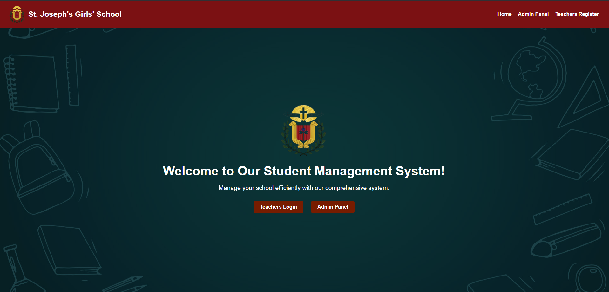

# Student Management System

## Overview
The **Student Management System** is a comprehensive web-based application designed to efficiently manage school operations. It provides tools for administrators, teachers, and students to streamline communication, improve record-keeping, and simplify daily administrative tasks.

This system supports functionalities such as user registration, login, student management, and more, ensuring a smooth workflow for all stakeholders involved.

---

## Features
### 1. **User Roles**
   - **Admin Panel**: Allows school administrators to manage teachers, students, and classes.
   - **Teacher Portal**: Enables teachers to register, log in, and access student records efficiently.

### 2. **Core Functionalities**
   - **User Authentication**:
     - Secure login and logout for admins and teachers.
   - **Student Management**:
     - Add, update, delete, and search for student details.
   - **Responsive Design**:
     - Fully optimized for mobile and desktop devices.
   - **Dynamic Dashboard**:
     - Displays an overview of school data such as student counts, teacher information, and grade distributions.

### 3. **Frontend**
   - Intuitive and user-friendly UI built with HTML and CSS.
   - Smooth navigation and visually appealing design.

### 4. **Backend**
   - Developed using PHP for handling business logic and database interactions.

### 5. **Database**
   - MySQL database for managing data such as student profiles, teacher accounts, and administrative records.

---

## Installation

### Prerequisites
Make sure the following are installed on your system:
- A web server (e.g., Apache, Nginx)
- PHP (>=7.4 recommended)
- MySQL
- A modern web browser

### Steps
1. Clone this repository:
   ```bash
   git clone https://github.com/<your-username>/student-management-system.git
   ```

2. Navigate to the project directory:
   ```bash
   cd student-management-system
   ```

3. Import the database:
   - Open your database management tool (e.g., phpMyAdmin).
   - Create a new database (e.g., `student_management`).
   - Import the `sms.sql` file into the newly created database.

4. Configure the database connection:
   - Open `db_connection.php`.
   - Update the database credentials (host, username, password, and database name):
     ```php
     $host = "localhost";
     $username = "root";
     $password = "";
     $database = "student_management";
     ```

5. Start your web server and access the system via:
   ```
   http://localhost/student-management-system
   ```

---

## File Structure
```
student-management-system/
├── Admin/
│   ├── dashboard.php
│   ├── db_connection.php
│   ├── login.php
│   ├── logout.php
│   ├── style.css
│   ├── styles.css
├── Images/
│   ├── background.jpg
│   ├── logo.png
├── Teacher/
│   ├── addstudent.php
│   ├── dashboard.php
│   ├── db_connection.php
│   ├── login.php
│   ├── logout.php
│   ├── register.php
│   ├── search_student.php
│   ├── style.css
│   ├── styles.css
├── .gitattributes
├── index.html           # Landing page
├── index.php            # Main entry point
├── README.md            # Project README
├── sms.sql              # SQL dump for the database
├── styles.css           # Main stylesheet
```

---

## Technologies Used
- **Frontend**: HTML5, CSS3
- **Backend**: PHP
- **Database**: MySQL
- **Version Control**: Git

---

## Screenshots
### Landing Page


---

## Contributing
Contributions are welcome! Follow these steps:
1. Fork the repository.
2. Create a new branch for your feature:
   ```bash
   git checkout -b feature-name
   ```
3. Commit your changes:
   ```bash
   git commit -m "Description of changes"
   ```
4. Push to the branch:
   ```bash
   git push origin feature-name
   ```
5. Open a pull request.

---

## License
This project is licensed under the MIT License. See the [LICENSE](LICENSE) file for details.

---

## Contact
For any questions or suggestions, feel free to reach out:
- **Email**: induwarapaduma2002@gmail.com
- **GitHub**: [@Padumainduwara](https://github.com/Padumainduwara)
- **Website**: www.padumainduwara.me

---

## Acknowledgments
- Special thanks to contributors and open-source libraries that helped make this project a success!

